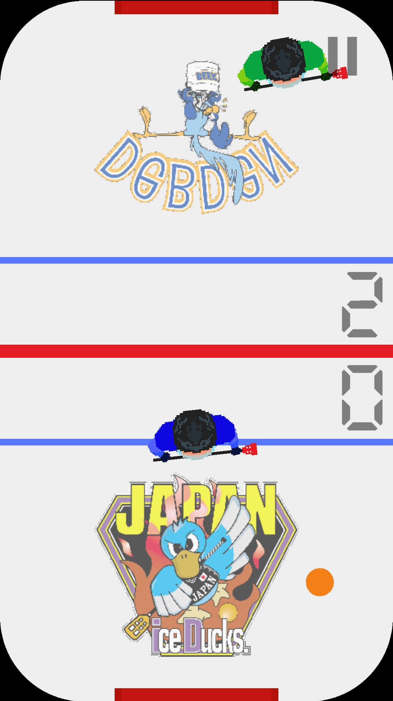

# Pocket Broomball

The world's first Broomball video game made with Godot Engine.  
This game is open source, with no ads and no tracking.

## Table of contents
- [Pocket Broomball](#pocket-broomball)
  - [Table of contents](#table-of-contents)
  - [Screenshots](#screenshots)
  - [Setup](#setup)
  - [Join with your Broomball team](#join-with-your-broomball-team)
  - [Arcade Highscores](#arcade-highscores)
  - [Contributions](#contributions)
  - [Licenses and Copyrights](#licenses-and-copyrights)

## Screenshots

  
  
  
  

## Setup
Get the latest version of the Godot Engine editor and check out the  
repo. Then open the `game/project.godot` file with the editor.

For further instructions, like exporting to mobile, please read the official [Godot Docs](https://docs.godotengine.org/en/stable/).

## Join with your Broomball team
If you want to see your broomball team or even the whole league in the game,  
just contact me at simon.dalvai@posteo.de  
Or make a pull request with the team's logos, names and stats (speed, power) and I'll publish them!

## Arcade Highscores

Google Play Services (Android) and GameCenter (iOS) are currently not working with the latest Godot 3.4.4.  
I'm working on it to make it work again.

## Contributions
If you want to contribute to the project, please fork the repo,    
make your changes and make a pull request with a short description  
of the changes you made.

## Licenses and Copyrights
The game itself is licensed under the GNU AGPL v3.0 or later license and all  
assets made by myself are licensed under the CC-BY-SA-4.0 license.  
All third parties assets and code have different licenses and copyrights holders.

This project uses the [FSFE reuse tool](https://github.com/fsfe/reuse-tool) to license files.  
But because currently no all assets have a valid license, `reuse lint` fails.  
Check out all licenses and copyrights holders [here](.reuse/dep5).  
The corresponding full license texts can be found in the LICENSES/ directory.

Note: The team logos where send to me by themselves so I'm authorized to use them.  
      Since they haven't issued a license for the logos, no license is available and  
      all rights belong to the corresponding team.  
      If you want to use them, please contact me at simon.dalvai@posteo.de or the  
      teams directly.
