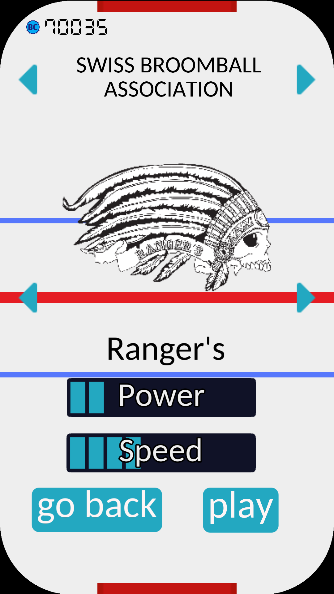
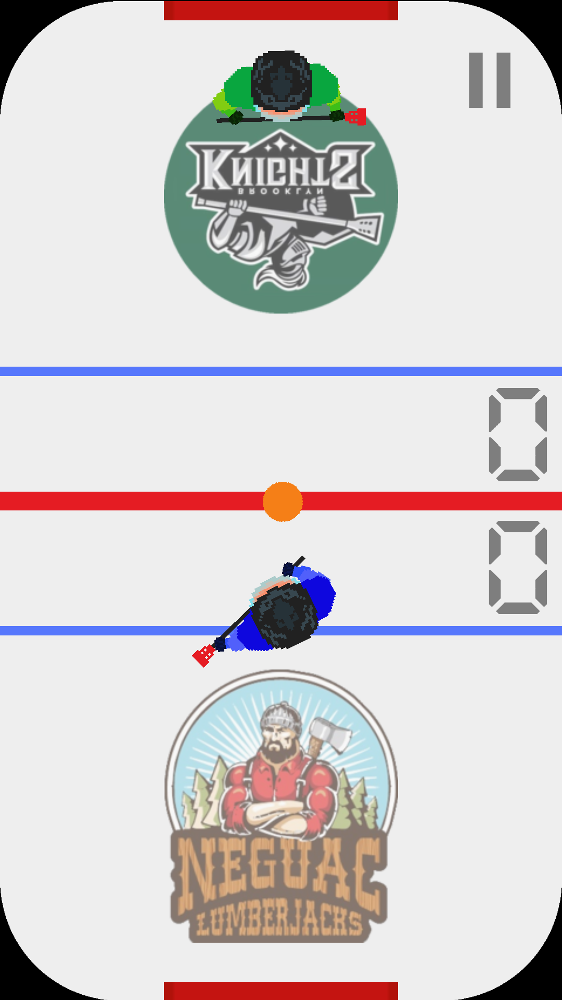
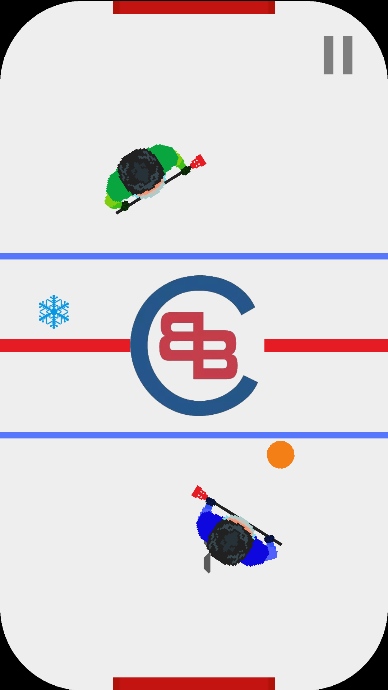

# Pocket Broomball
[](https://github.com/dulvui/pocket-broomball/actions/workflows/upload-android.yml)
[](https://github.com/dulvui/pocket-broomball/actions/workflows/upload-ios.yml)
[](https://github.com/dulvui/pocket-broomball/actions/workflows/upload-itchio.yml)

The world's first Broomball video game made with Godot Engine.  
This game is open source, with no ads and no tracking.

<a href="https://play.google.com/store/apps/details?id=com.salvai.broomball" target="_blank"></a>
<a href="https://apps.apple.com/app/pocket-broomball/id1511009171" target="_blank"></a>

<div>
  
  
  
  
</div>

## Table of contents
- [Pocket Broomball](#pocket-broomball)
  - [Table of contents](#table-of-contents)
  - [Setup](#setup)
    - [export\_presets.cfg](#export_presetscfg)
  - [Join with your Broomball team](#join-with-your-broomball-team)
  - [Arcade Highscores](#arcade-highscores)
  - [Contributions](#contributions)
  - [Licenses and Copyrights](#licenses-and-copyrights)
  - [Licenses](#licenses)
  - [Third party assets](#third-party-assets)
    - [Audio](#audio)
    - [2D assets](#2d-assets)
    - [3D assets](#3d-assets)
    - [Font](#font)

## Setup
Get the latest version of the Godot Engine editor and check out the  
repo. Then open the `game/project.godot` file with the editor.

For further instructions, like exporting to mobile, please read the official [Godot Docs](https://docs.godotengine.org/en/stable/).

### export_presets.cfg

To be able to export for Android or iOS, copy the `export_presets.exmaple` file and fill in your values.
```sh
cp game/export_presets.example game/export_presets.cfg
```

## Join with your Broomball team
If you want to see your broomball team or even the whole league in the game,  
just contact me at info@simondalvai.org  
Or make a pull request with the team's logos, names and stats (speed, power) and I'll publish them!

## Contributions
If you want to contribute to the project, please fork the repo,    
make your changes and make a pull request with a short description  
of the changes you made.

## Licenses and Copyrights
The game itself is licensed under the GNU AGPL v3.0 or later license and all  
assets made by myself are licensed under the CC-BY-SA-4.0 license.  
All third parties assets and code have different licenses and copyrights holders.

This project uses the [FSFE reuse tool](https://github.com/fsfe/reuse-tool) to license files.  
But because currently no all assets have a valid license, `reuse lint` fails.  
Check out all licenses and copyrights holders [here](.reuse/dep5).  
The corresponding full license texts can be found in the LICENSES/ directory.

Note: The team logos where send to me by themselves, so I'm authorized to use them.  
      Since they haven't issued a license for the logos, no license is available and  
      all rights belong to the corresponding team.  
      If you want to use them, please contact me at info@simondalvai.org or the  
      teams directly.

## Licenses
The game itself is licensed under the [GNU AGPL v3.0](LICENSE) license and all  
assets made by myself are licensed under the [CC-BY-SA-4.0](https://creativecommons.org/licenses/by-sa/4.0/) license.


## Third party assets

### Audio

"The heist" Royalty-Free Music by https://audiohub.com is licensed under [CC-BY-4.0](https://creativecommons.org/licenses/by/4.0/)
```
game/assets/audio/heist.ogg
```

"Snares and Crash" by LMMS (https://github.com/LMMS/assets) are licensed under [CC0-1.0](https://creativecommons.org/publicdomain/zero/1.0/)
```
game/assets/audio/snare05.ogg
game/assets/audio/snare02.ogg
game/assets/audio/crash02.ogg
```
### 2D assets


"Game Icons" by kenney.nl (https://www.kenney.nl/assets/game-icons) are licensed under [CC0-1.0](https://creativecommons.org/publicdomain/zero/1.0/)
```
game/assets/star.png
game/assets/right.png
game/assets/musicOn.png
game/assets/musicOff.png
game/assets/left.png
game/assets/audioOn.png
game/assets/audioOff.png
game/assets/arrowDown.png
game/assets/information.png
game/assets/pointer.png
```

"Patterns Pack" by kenney.nl (https://www.kenney.nl/assets/pattern-pack) are licensed under [CC0-1.0](https://creativecommons.org/publicdomain/zero/1.0/)
```
game/assets/patterns/pattern_04.png
game/assets/patterns/pattern_09.png
game/assets/patterns/pattern_27.png
```

"Patterns Pack 2" by kenney.nl (https://www.kenney.nl/assets/pattern-pack-2) are licensed under [CC0-1.0](https://creativecommons.org/publicdomain/zero/1.0/)
```
README.md
game/assets/patterns/pattern_0001.png
game/assets/patterns/pattern_0003.png
game/assets/patterns/pattern_0007.png
game/assets/patterns/pattern_0008.png
game/assets/patterns/pattern_0021.png
game/assets/patterns/pattern_0024.png
game/assets/patterns/pattern_0025.png
```

### 3D assets
"Star" by Savino (https://opengameart.org/content/star-0) is licensed under [CC0-1.0](https://creativecommons.org/publicdomain/zero/1.0/)
```
game/assets/obj/star.obj
```

"Volleyball" by PatelDev (https://skfb.ly/6VWCM) is licensed under [CC-BY-4.0](http://creativecommons.org/licenses/by/4.0/).
```
game/assets/obj/Volleyball.obj
```

"Football" by siixarn (https://skfb.ly/KqJH) is licensed under [CC-BY-4.0](http://creativecommons.org/licenses/by/4.0/).
```
game/assets/obj/Football.blend.obj
``` 

"Octoball" by EZduzziteh (https://opengameart.org/content/some-more-wire-balls) is licensed under [CC-BY-3.0](https://creativecommons.org/licenses/by/3.0/)
```
game/assets/obj/Octoball.obj
```

### Font
"manrope.thin.otf" by sharanda (https://github.com/sharanda/manrope) is licensed under [SIL Open Font License](https://scripts.sil.org/cms/scripts/page.php?site_id=nrsi&id=OFL)
```
game/assets/font/manrope.thin.otf
```
